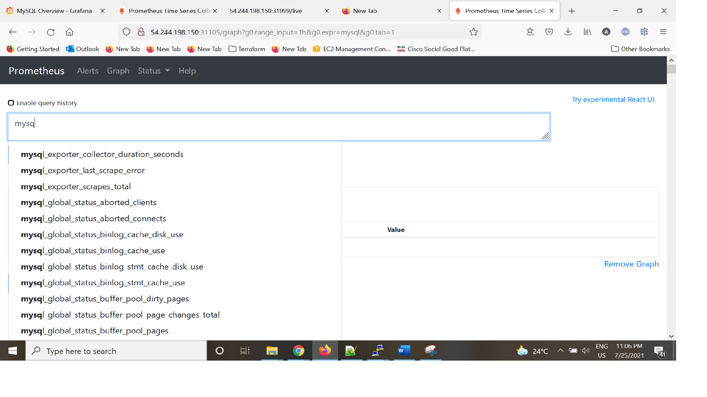
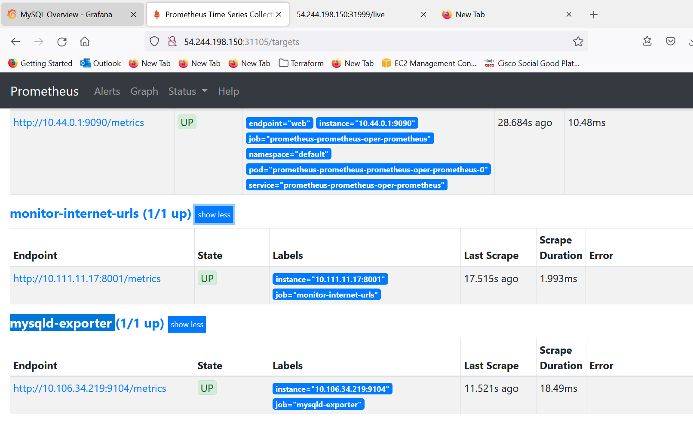
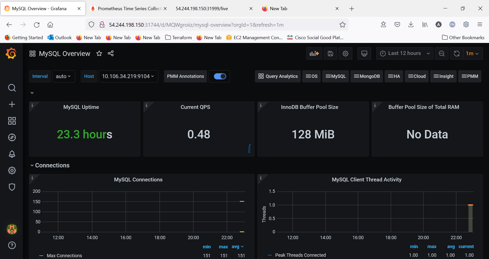
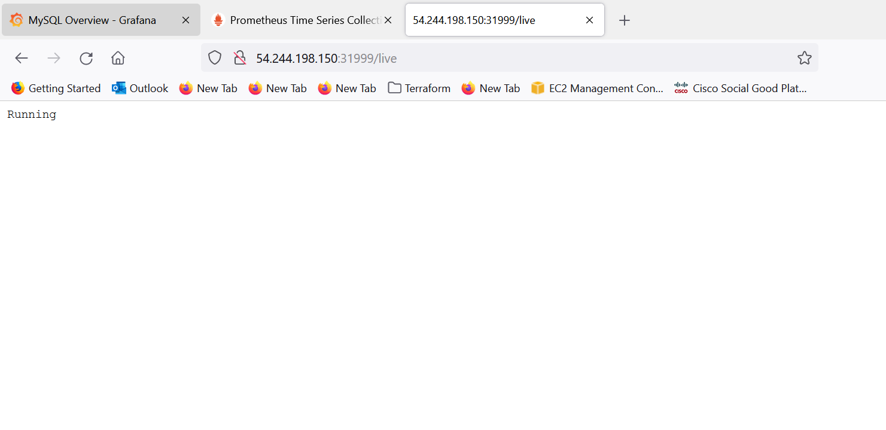

# Simple Service Webapp

Simple-service is an golang HTTP api.It has only a /live endpoint answering text/plain; charset=utf-8. The following responses are possibly:

Well done :): if the application was able to connect with a Postgres database.

Running: if some error occurred during the connection with the database.

# MySQL DB as Statefulset

Deploy MySQL as Statefulset in Kubernetes Cluster and deploy mysqld-exporter to provide prometheus metrics from MySQL DB. 

---

## Application's Screenshots

##### Metrics in Prometheus


##### Prometheus Targets


### Grafana Dashboard



##### Simple Service Webapp


---
## Technology Used

-   [Python3](https://www.python.org/)
-   [Prometheus](https://github.com/prometheus/client_python.git)
-   [Kubernetes](https://kubernetes.io/)
-   [Helm3](https://helm.sh/)
-   [Grafana](https://grafana.com/)

---
## Set-up
1. Build Docker image and push to repository of your choosing

```shell
docker build -t $USERNAME/simple-service:$tagname .
docker push $USERNAME/simple-service:$tagname
```

3. Create kubernetes cluster with 1.15+ using any Kubernetes cluster creation method.

- [Kubeadm](https://kubernetes.io/docs/setup/production-environment/tools/kubeadm/install-kubeadm/)
- [EKS](https://docs.aws.amazon.com/eks/latest/userguide/create-cluster.html)


4. Use `helm3` to install Prometheus & Grafana using prometheus-operator

```shell
#Install Helm3
https://helm.sh/docs/intro/install/
$ curl -fsSL -o get_helm.sh https://raw.githubusercontent.com/helm/helm/master/scripts/get-helm-3
$ chmod 700 get_helm.sh
$ ./get_helm.sh

#Install Prometheus & Grafana
helm repo add stable https://charts.helm.sh/stable
helm repo update
helm install prometheus stable/prometheus-operator
```

### Testing (Docker + Kubernetes)

To test with kubernetes cluster ensure that it is properly installed according to your operating system.

1.  Create kubernetes secret & update `imagePullSecrets` in [deployment.yaml](deployment.yaml).
```shell
kubectl create secret docker-registry regcred --docker-server=<your-registry-server> --docker-username=<your-name> --docker-password=<your-pword> --docker-email=<your-email>
```
2. In [deployment-prod.yaml](deployment-prod.yaml) change `image: akshaygirpunje/simple-service:v18` to newly built Docker image you done in the set-up and also change the secret name.

3.  Run `kubectl deployment-prod.yaml and service.yaml`

```shell
kubectl apply -f deployment-prod.yaml
deployment.apps/simple-service created

kubectl apply -f deployment.yaml
service/simple-service created
```
-   View the deployment

```shell
kubectl get deployment simple-service

NAME             READY   UP-TO-DATE   AVAILABLE   AGE
simple-service   1/1     1            1           9d
```

4.  Install `metrics-server` to monitor the simple-service pods & implement the HPA.

```shell
- kubectl apply -f https://github.com/kubernetes-sigs/metrics-server/releases/download/v0.5.0/components.yaml
serviceaccount/metrics-server configured
clusterrole.rbac.authorization.k8s.io/system:aggregated-metrics-reader configured
clusterrole.rbac.authorization.k8s.io/system:metrics-server configured
rolebinding.rbac.authorization.k8s.io/metrics-server-auth-reader configured
clusterrolebinding.rbac.authorization.k8s.io/metrics-server:system:auth-delegator configured
clusterrolebinding.rbac.authorization.k8s.io/system:metrics-server configured
service/metrics-server configured
deployment.apps/metrics-server created
apiservice.apiregistration.k8s.io/v1beta1.metrics.k8s.io configured


- kubectl autoscale deployment simple-service --cpu-percent=35 --min=2 --max=4
horizontalpodautoscaler.autoscaling/simple-service autoscaled

-kubectl get hpa
NAME             REFERENCE                   TARGETS         MINPODS   MAXPODS   REPLICAS      AGE
simple-service   Deployment/simple-service   1%/35%             2         4         2          45s
```
5.  Configure `mysql DB` as statefulset.
```shell
- kubectl get statefulset,pod|grep -i mysql-container
statefulset.apps/mysql-container                                        2/2     32h
pod/mysql-container-0                                        1/1     Running   0          3s
pod/mysql-container-1                                        1/1     Running   0          32h

```
6.  Installation Of Prometheus Operator and `mysqld-exporter` to export the mysql DB metrics to prometheus.
```shell
helm install prometheus stable/prometheus-operator
helm install prometheus-mysql-exporter prometheus-community/prometheus-mysql-exporter
```

7.  View the services & if you want to access the Prometheus,Grafana URL from outside of cluster change the type of `prometheus-grafana` & `prometheus-prometheus-oper-prometheus` services to NodePort or LoadBalancer from ClusterIP. 

```shell
kubectl get services
NAME                                      TYPE        CLUSTER-IP       EXTERNAL-IP   PORT(S)                      AGE
alertmanager-operated                     ClusterIP   None             <none>        9093/TCP,9094/TCP,9094/UDP   10h
kubernetes                                ClusterIP   10.96.0.1        <none>        443/TCP                      2d22h
monitor-internet-urls                     NodePort    10.111.11.17     <none>        8001:31060/TCP               3h18m
mysql                                     ClusterIP   10.102.183.81    <none>        3306/TCP                     24h
mysqld-exporter                           NodePort    10.106.34.219    <none>        9104:31362/TCP               10h
prometheus-grafana                        NodePort    10.103.255.157   <none>        80:31744/TCP                 10h
prometheus-kube-state-metrics             ClusterIP   10.107.212.55    <none>        8080/TCP                     10h
prometheus-operated                       ClusterIP   None             <none>        9090/TCP                     10h
prometheus-prometheus-node-exporter       ClusterIP   10.107.53.138    <none>        9100/TCP                     10h
prometheus-prometheus-oper-alertmanager   ClusterIP   10.109.48.122    <none>        9093/TCP                     10h
prometheus-prometheus-oper-operator       ClusterIP   10.97.212.254    <none>        8080/TCP,443/TCP             10h
prometheus-prometheus-oper-prometheus     NodePort    10.96.241.233    <none>        9090:31105/TCP               10h
simple-service                            NodePort    10.100.242.112   <none>        8000:31999/TCP               10h
```

8. Test services through `CLI` or `Web Browser`

- Check using CLI

```shell
curl http://10.100.242.112:8000/live
Running
```

-   Check `prometheus-grafana` , `prometheus-prometheus-oper-prometheus` & `simple-service` services using web browser.

```shell
#Syntax
#http://{WorkerNodeIp or LB}:NodePort
http://{WorkerNodeIp or LB}:31150
http://{WorkerNodeIp or LB}:31744
http://{WorkerNodeIp or LB}:31999/live 
```

---
9. Add the service `mysqld-exporter` endpoint to prometheus's target by adding `job_name` in [value1.yaml](values1.yaml) at `additionalScrapeConfigs` section as follows.

```shell
    additionalScrapeConfigs:
      - job_name: 'mysqld-exporter'
        honor_labels: true
        static_configs:
        - targets: ['{WorkerNodeIp or LB}:9104']
```

7. Update the `prometheus-operator` repo with new service endpoint.
   - It will add the endpoint to prometheus's target.
   - Check `prometheus-grafana` , `prometheus-prometheus-oper-prometheus` services & modify type if require.
   - Check the target in prometheus dashboard at path http://{WorkerNodeIp or LB}/targets
```shell
 helm upgrade  prometheus stable/prometheus-operator -f values1.yaml
```

8. Test `MySQL DB` metrics & targets in prometheus at following path.
```shell
 http://{WorkerNodeIp or LB}:31105/graph
 http://{WorkerNodeIp or LB}:31105/targets
```
9. Configure Grafana Dashboard using following dashboard.
```shell 
https://grafana.com/grafana/dashboards/7362
```
---
